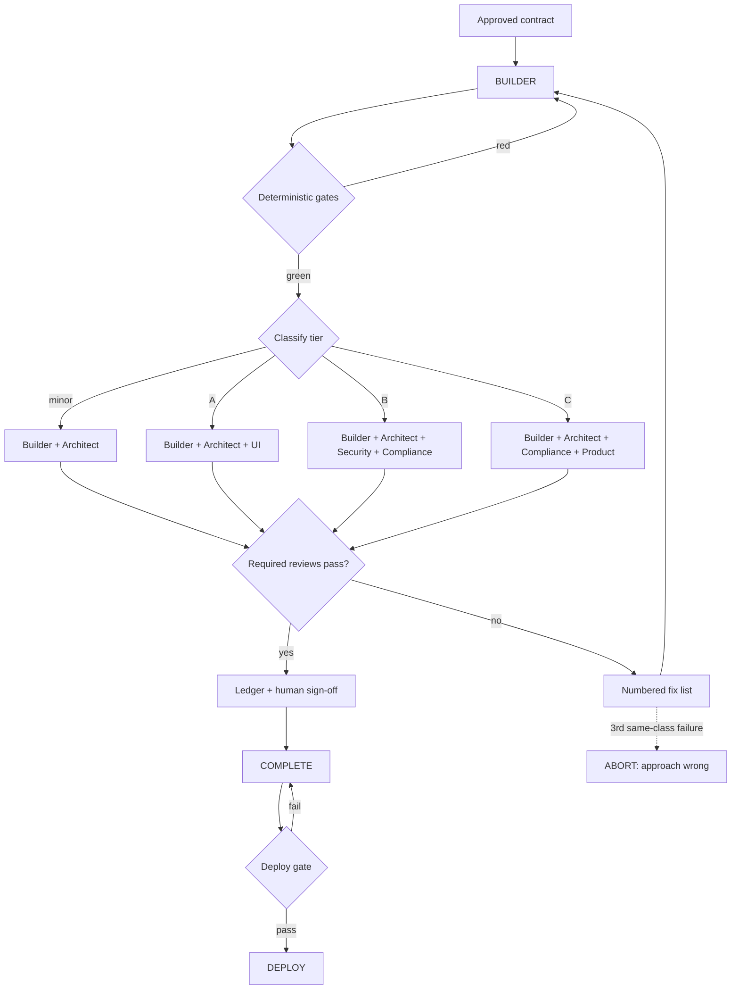
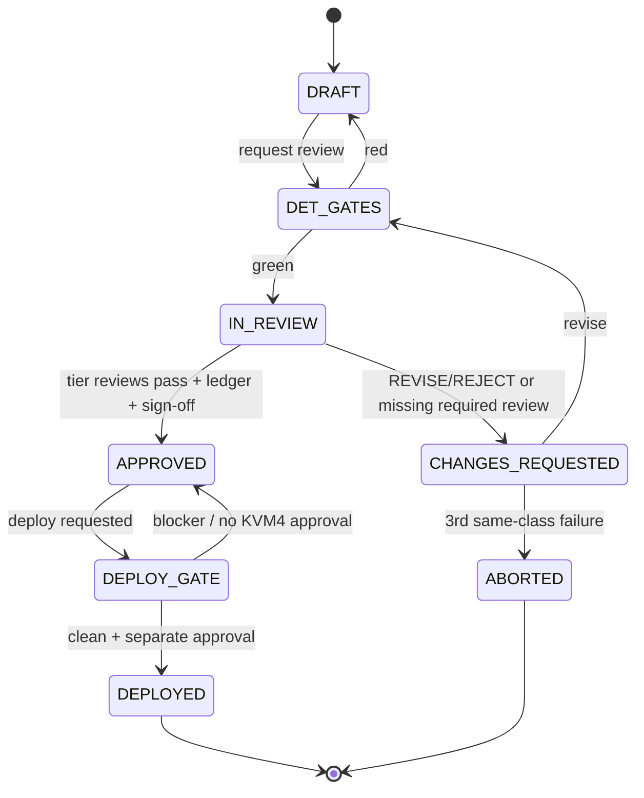

# DhanRadar — AI Governance Model (Multi-Agent Roles & Tiered Approval Gates)

**Date:** 2026-06-06 (rev. 3 — review cadence: full ceremony batched to end-of-phase / pre-deploy)
**Status:** Canonical operating model for how Claude Code executes work on DhanRadar.
**Supersedes:** the implicit "Claude Code = builder + planner" model, rev. 1's
all-six-gates-per-major-change rule, and rev. 2's implied per-change full-ceremony cadence.
**Authority order (binding):** `DhanRadar_Architecture_Final.md` →
`DhanRadar_Implementation_Plan.md` → existing code → `docs/features` → `docs/ui-system` →
mockups.
**Scope:** governance and process only. **No runtime code is modified by this document.**

---

## 0. Why this model

DhanRadar is a SEBI-boundary fintech product. A single agent acting as builder + planner is fast
but structurally unsafe: the builder is the worst reviewer of its own work, and the most
expensive failures here are **legal** (advisory framing, disclosure gaps, consent bypass) and
**security** (auth/session/secrets), not cosmetic bugs.

Claude Code therefore wears up to **six hats** — Builder, Architect, Security, Compliance, UI,
Product — each run as an **independent agent** with a self-contained prompt, producing review
output the orchestrator cannot silently override. To keep this lightweight, **which reviews run
is decided by a 3-tier classification** (§3), and **all output for one change lives in a single
file** (§5).

This is multi-agent governance, not multi-step prompting: a reviewer agent is **never the same
agent instance that built the code**, sees the **diff + contract** rather than the build
conversation, and ends with an explicit **verdict**.

---

## 1. Governing principles

1. **Independence.** A reviewer is a fresh subagent with a self-contained prompt (Phase-1 contract
   rules: file paths + exact contract + acceptance criteria + report shape). It must not inherit
   the builder's reasoning. The orchestrator (Opus) routes and adjudicates but does not author a
   review of its own build.
2. **Fail-closed.** A missing required review = NOT approved. Ambiguous verdict = REVISE. A
   Security or Compliance reviewer that cannot run blocks the merge (use the fallback ladder;
   never skip).
3. **Machine gates first.** Deterministic checks (tests, secrets scan, anti-pattern + IGNORE-list
   grep, ruff/mypy/tsc) run **before** any LLM reviewer spends tokens. A red gate bounces straight
   back to Builder; reviewers never review broken code.
4. **Evidence before verdict.** Every reviewer cites `file:line` and, where claimed, the command
   output or test that proves it.
5. **Right-sized review.** The tier (§3) determines which reviews are mandatory — not every change
   gets every reviewer. The classification itself is recorded, so a skipped dimension is a logged
   decision, never silent.

---

## 2. The six roles (capabilities)

Each role's full review checklist + output template is in §6. Tier mapping for **when** each runs
is in §3.

| Role | Default agent / tier | Mandate (one line) |
|---|---|---|
| **Builder** | Sonnet; **Opus** for auth/session/scoring/classifier paths | implement the approved contract; honor every non-negotiable |
| **Architect Reviewer** | Sonnet; **Opus** for module-boundary/schema/engine-contract | drift, scalability, tech debt, data model, API quality |
| **Security Reviewer** | **`codex:rescue`** (fallback: Sonnet → Opus takeover) | authN/authZ/session/secrets/API/OWASP + prompt-injection |
| **Compliance Reviewer** | **Opus** | SEBI educational boundary, recommendation language, risk-profile separation, confidence/fair-value exposure |
| **UI Reviewer** | Sonnet; **Opus** when UI shows score/label/AI | branding, design system, a11y, mobile, token compliance |
| **Product Reviewer** | Sonnet | UX, completeness, edge cases, flows, analytics |

**Independence rule (hard):** the agent that wrote a diff may not review it for any dimension. The
orchestrator fans out the tier's reviewers in **one parallel message**, collects verdicts, and
adjudicates.

---

## 3. Review tiers (which reviews are mandatory)

Every change is classified into exactly one tier. **Builder + Architect Review are required in
every tier.** Tier adds the dimensions that match the change's risk surface.

### Tier A — Standard features

*Non-load-bearing features, UI screens/components, general endpoints, docs-bearing work.*

- **Builder**
- **Architect Review**
- **UI Review** *(N/A-with-reason only for pure-backend changes with no DOM surface)*

### Tier B — Security / Auth / Billing / AI / Compliance

*Auth, session, secrets, API security surface; payments/webhooks; AI gateway/prompt/classifier;
consent/DPDP; the audit trail.*

- **Builder**
- **Architect Review**
- **Security Review** (`codex:rescue`, fail-closed)
- **Compliance Review** (Opus)

### Tier C — Scoring engine / Recommendation logic

*The rating/scoring engine, `ranking_configs`, label/confidence/fair-value derivation, the
recommendation surface.*

- **Builder**
- **Architect Review**
- **Compliance Review** (Opus — labels, no-numeric-in-DOM, risk-profile exclusion, exposure gates)
- **Product Review** (edge cases: insufficient data, partial coverage, stale feed, tier gating)

### 3.1 Classification rules

- **Pick the highest-risk tier the change touches** (C > B > A).
- **Add one cross-tier dimension when a surface from another tier is clearly present** — e.g. a
  Tier-C scoring change that also ships a screen adds **UI Review**; a Tier-A screen that surfaces
  a score/label/AI output adds **Compliance Review**. Record the addition in the gate ledger.
- **Minor changes** (comments, dev tooling, test-only, non-load-bearing refactor with no interface
  change) → **Builder + Architect Review only**, classified "minor: <reason>" in the ledger. A
  minor change may never touch a load-bearing or compliance-sensitive path; if it does, it is by
  definition Tier B or C.

### 3.2 Review cadence (when the tier's reviews actually run)

DhanRadar is **pre-launch with no users**; review value scales with blast radius, which is
currently near zero. To keep feature throughput high without weakening the gates that matter, the
**tier's reviewer ceremony is batched, not per-session** — with a hard load-bearing exception.

- **Per-session default (active development):** run **Builder + Architect Review only** and log it.
  Build features; do not fan out the full tier panel for every change. The goal each session is to
  move the MF-first wedge forward (CAS upload → ≤60s labelled report), not to produce review
  artifacts.
- **Load-bearing exception (never deferred):** any change touching a **load-bearing path**
  (`backend/**/auth/*`, session/JWT, `RequireTier`/`RequireConsent`; payments/webhook;
  scoring/rating engine + `ranking_configs`; AI gateway/prompt/classifier/budget; consent/DPDP +
  `ai_recommendation_audit`; Alembic migrations; compose/cloudflared/`infra/`) gets its full tier
  review (**Tier B/C**, incl. `codex:rescue` Security + Opus Compliance) **inline, in the same
  session it lands** — fail-closed, exactly as §3 specifies. Security/Compliance sign-off on these
  paths is **never batched or deferred**.
- **Deterministic gates are never deferred:** tests, secrets scan, anti-pattern + IGNORE-list grep,
  ruff/mypy/tsc run **per commit** on every change regardless of cadence (Principle 3 stands).
- **Batched audit pass (end-of-phase / pre-deploy):** the deferred dimensions for non-load-bearing
  work — **UI, Product, full Architect drift sweep, and a consolidated Compliance read of any
  score/label/AI surfaces shipped during the phase** — run as **one dedicated audit pass at the end
  of a development phase**, and always before a KVM4 deploy. This pass folds into the **Phase-7 §5
  adversarial gate** (§7.3); a phase is not deploy-eligible until it clears.
- **Ledger honesty:** a change whose tier reviews were deferred is recorded in
  `reviews/<change-id>.md` as **status `NOT-COMPLETE (reviews batched to phase audit)`**, naming the
  pending dimensions. Deferral is a logged decision, never silent, and a deferred change is
  **merge-eligible only as work-in-progress, never deploy-eligible** until the batched pass clears
  it.

**One-line rule:** build features per session with Builder + Architect; run the full reviewer
panel once per phase (and always pre-deploy) — except on load-bearing paths, which keep their full
inline review every time they are touched.

---

## 4. Severity & verdict model (shared by all reviewers)

**Severity:**

- **BLOCKER** — legal exposure, security hole, data-loss, or a non-negotiable violated. Cannot
  merge. (Security/Compliance BLOCKERs are also deploy-blockers.)
- **MAJOR** — likely defect, invariant erosion, or significant UX/scale problem. Fix before merge.
- **MINOR** — should fix; may merge with a tracked follow-up in `BLOCKERS.md`.
- **NIT** — optional polish.

**Verdict (each review ends with exactly one):**

- **ACCEPT** — no BLOCKER/MAJOR.
- **ACCEPT-WITH-CONDITIONS** — MINORs only, each tracked.
- **REVISE** — at least one MAJOR; return a numbered fix list to Builder.
- **REJECT** — a BLOCKER, or the approach itself is wrong (invoke the abort criterion: stop, state
  why, propose an alternative; do not loop).

A gate passes only at ACCEPT or ACCEPT-WITH-CONDITIONS. The orchestrator may not upgrade a verdict;
it may only send work back or escalate a contested REJECT to the human.

---

## 5. Review storage (single file per change)

To avoid artifact sprawl, **all governance output for one change lives in one file**:

```text
docs/project-state/reviews/<change-id>.md
```

where `<change-id>` is the phase/slice or feature branch (e.g. `phase-2-slice-2-consent`,
`stage2-step5-rfc7807`). The file contains, in order:

1. **Gate ledger** (top) — tier, verdicts, final status, human sign-off.
2. **Builder summary.**
3. **Only the review sections required by the tier** (§3) — omitted sections are simply absent;
   their absence is explained by the tier line in the ledger.

This file is committed **with the change**, so the review trail is part of git history (feeds the
SEBI "methodology transparency" + the hash-chained audit posture).

### 5.1 `reviews/<change-id>.md` skeleton

```markdown
# Review — <change-id>

## Gate ledger
**Tier:** A | B | C (+ added dimensions, if any)   **Class:** major | minor (<reason>)
**Diff:** <commit range / branch>   **Date:** YYYY-MM-DD

| Gate | Required by tier? | Verdict | Reviewer/tier | Conditions open? |
|---|---|---|---|---|
| Deterministic (tests/grep/secrets) | always | PASS/FAIL | machine | — |
| Architect | always | ACCEPT/… | <tier> | <y/n> |
| Security | tier B | ACCEPT/… | codex/… | <y/n> |
| Compliance | tier B,C | ACCEPT/… | Opus | <y/n> |
| UI | tier A | ACCEPT/N-A | <tier> | <y/n> |
| Product | tier C | ACCEPT/… | Sonnet | <y/n> |

**Final status:** COMPLETE | NOT-COMPLETE (<blocking gate>)
**Human operator sign-off:** <name + date>   **Deploy-eligible?:** yes only if no open BLOCKER

## Builder summary
<what was built · contract · non-negotiables touched · deterministic-gate output · feature doc + RCA · deferred → BLOCKERS.md>

## Architect review
<verdict + findings (severity-tagged, file:line)>

## Security review        (tier B only)
## Compliance review      (tier B and C)
## UI review              (tier A; or added)
## Product review         (tier C; or added)
```

---

## 6. Role checklists & section templates

Each review is a section inside `reviews/<change-id>.md`, headed by its **Verdict** line and a
**severity-tagged findings list** (`[BLOCKER|MAJOR|MINOR|NIT] <issue> — file:line — <fix>`).

### 6.1 Builder

- **Responsibilities:** implement the approved contract exactly ("copy the documented pattern");
  honor every non-negotiable (scores read-only; `scoring` ⊄ `billing`; AI never advises/invents
  numbers; risk profile never feeds the score; `Idempotency-Key`; disclosures via the Compliance
  Gate; freshness honesty; confidence band-only; a11y four states); respect KEEP/MERGE/REPLACE/
  IGNORE; append RCA per fix; keep the feature doc as-built; run deterministic gates locally.
- **Deliverables:** the diff (+ lockfile for dep changes); updated `docs/features/<module>.md`;
  RCA entries; the **Builder summary** section; green deterministic-gate output.
- **Approval requirements:** **cannot self-approve** and cannot mark its own review N/A; must list
  which non-negotiables the diff touches so reviewers can target them.

### 6.2 Architect review (always)

- Architecture drift (interface-only coupling, no cross-module JOIN/INSERT, `scoring` ⊄ `billing`,
  schema-per-concern, module isolation) · scalability (indexes/queries, Celery/IST, KVM4 budget,
  no ES, cache-invalidation) · technical debt (TODO/FIXME, dead code, migration reversibility) ·
  data model (UUID PK, snake_case, schema-qualified, FKs, hypertables, `model_version`
  immutability) · API quality (`/api/v1`, cookie auth, RFC7807 + `request_id`, `Idempotency-Key`,
  401/402/403, matches `openapi.yaml`).

### 6.3 Security review (Tier B)

- AuthN (RS256 only, alg/typ-confusion rejected, expiry, argon2id) · AuthZ (`RequireTier` → 402,
  ownership/role 403, no IDOR, server-set `notes.user_id`) · session (`__Host-` cookies, refresh
  rotation + reuse detection atomic `GETDEL`, logout revokes refresh jti + denylists access jti,
  no permissive CORS) · secrets (regex sweep; env/file/GitHub Secrets only; none in logs/`detail`)
  · API security (webhook verify-before-parse + event dedup; rate-limit wired + `CF-Connecting-IP`;
  RFC7807 leaks no trace/PII; no login enumeration) · OWASP Top-10 + **prompt-injection** ("pretend
  to be an advisor" → refuse + log). Default to "unsafe if uncertain." Record gate availability /
  which fallback was used.

### 6.4 Compliance review (Tier B and C)

- Educational-vs-advisory boundary (no buy/sell/hold anywhere) · recommendation language (labels
  `in_form/on_track/off_track/out_of_form/insufficient_data`; advisory verbs rejected; label from
  the rule table, not a pure function of the score) · risk-profile separation (excluded from all
  scoring inputs; sole writer Onboarding) · confidence exposure (band-only; `<0.30 →
  insufficient_data`; no numeric %) · fair-value exposure (Pro-gated; off public DOM) ·
  SEBI-sensitive (disclosure bundle + `NOT_ADVICE` on every score/label/AI surface, tied to the
  in-force disclaimer in `ai_recommendation_audit`; label-churn >5% → `pending_publish` human gate;
  DPDP per-purpose consent on data-processing routes; cross-border check before non-Indian LLMs).
  Any advisory-verb hit or numeric-in-DOM is a **BLOCKER**. Launch-blocking legal ambiguity →
  REVISE with a note to validate with retained Indian securities counsel.

### 6.5 UI review (Tier A; or added)

- Branding (`docs/brand/` Geist/warm; Manrope/cool retired, must not appear) · design system
  (reuse patterns/tokens; new components reusable + documented) · accessibility (four states,
  focus rings, chart text-alternatives, axe + Lighthouse budgets, keyboard, contrast) · mobile
  responsiveness · token compliance (tokens only, no magic numbers, brand keys `royal`/
  `ink-secondary`). **Compliance seam:** ScoreRing renders a band not a number; RecommendationCard
  uses non-advisory labels (escalate to Compliance if it shows score/label/AI).

### 6.6 Product review (Tier C; or added)

- UX (flows match route-map/screen specs; states handled; paywall = 402 contextual, not an error
  card; "as of" freshness shown) · feature completeness (DoD: four states · a11y · analytics fired
  · error-catalog mapping · tests · disclosures · perf/bundle budget; no placeholder screens) ·
  edge cases (`insufficient_data`, stale/offline, partial coverage, anon/free/Pro, first-run
  `not_set`, large portfolios, quota exhaustion) · user flows (end-to-end hops prove out;
  back/refresh/deeplink) · analytics (typed `track()` per taxonomy; no PII; names match catalog).

---

## 7. Approval gates

### 7.1 Completion rule

A change is **complete** only when: the deterministic gates are green **and** every review
**required by its tier** (§3) carries a passing verdict (ACCEPT / ACCEPT-WITH-CONDITIONS) **and**
the gate ledger in `reviews/<change-id>.md` is signed off by the human operator. A REVISE/REJECT
or a missing required review = not complete.

### 7.2 Scoring-engine activation — two-person methodology gate (documented; NON-BLOCKING for now)

Activating or changing `ranking_configs` (weights/bands/normalization/labels) is intended to
require `approved_by ≠ created_by` (architecture §S4), satisfied by the Compliance + Architect
reviewers as independent agents + recorded in `rating_engine_changelog` + human sign-off, with the
builder agent as neither approver.
**Status:** this requirement is **documented but does NOT block implementation** at the current
stage. It is a **production-readiness gate**, tracked in `BLOCKERS.md` (B6), to be enforced before
any `ranking_configs` version is **activated** in production. Until then a `ranking_configs` record
is staged "unactivated; pending backtest pass-gates + two-person approval."

### 7.3 Deploy gate

A passing ledger is **merge-eligible, not deploy-eligible**. KVM4 deploy needs: no open
Security/Compliance BLOCKER + the Phase-7 §5 adversarial gate logged + **separate explicit human
approval**. The ❌ NEVER-TOUCH list + 3 cloudflared gotchas (`infra-notes.md`) apply; the GitHub
`production` env is main-branch-gated.

### 7.4 Revision loop

REVISE → orchestrator returns a numbered, independent fix list to Builder (fire parallel Sonnet
revisions if issues are independent) → re-run deterministic gates → re-review **only the affected
dimensions**. Loop at most twice; on a third same-class failure, invoke the **abort criterion**
(the approach is wrong — stop, state why, propose an alternative; do not escalate a doomed design).

---

## 8. Workflow diagrams

### 8.1 Tiered flow (ASCII)

```text
 approved contract
        │
        ▼
 [BUILD] Builder ──► [DET. GATES] tests · anti-pattern+IGNORE grep · secrets · ruff/mypy/tsc
        ▲                  │ red → bounce to Builder (no reviewer tokens spent)
        │ REVISE           ▼ green
        │            [CLASSIFY TIER]
        │              ├─ minor ───────────► Builder + Architect ──┐
        │              ├─ A ──► Builder + Architect + UI ──────────┤
        │              ├─ B ──► Builder + Architect + Security + Compliance ─┤
        │              └─ C ──► Builder + Architect + Compliance + Product ──┤
        │                         (+ add a cross-tier review if a surface applies)
        │                                                          ▼
        │                                            collect tier verdicts
        │                                                          │
        │           any REVISE/REJECT or missing required review? ─┤
        │                          │ no                            │ yes (≤2 loops;
        │                          ▼                               │  3rd same-class → ABORT)
        │             [LEDGER] tier reviews pass ──────────────────┘
        │                          │
        │                          ▼  human operator sign-off
        │                   COMPLETE (merge-eligible)
        │                          │
        │                          ▼  deploy? no Sec/Compliance BLOCKER + Phase-7 §5 + separate KVM4 approval
        └────────────────────────────────────────────────────────► DEPLOY
```

### 8.2 Tiered flow (Mermaid)



### 8.3 Gate state machine (Mermaid)



---

## 9. Integration with the existing playbook

- **Phase 0–1** → Builder. **Phase 2** → the deterministic machine plane (run before reviewers).
- **Phase 3** → per the cadence (§3.2): Builder + Architect inline each session; the full tier
  panel fans out **once per phase / pre-deploy** for non-load-bearing work, but **inline every time**
  for load-bearing paths. **Phase 4** → the revision loop + abort criterion. **Phase 5** → read
  as-landed files + green tests; the ledger is the verification record. **Phase 6** → update
  `SESSION_STATE.md` + `BLOCKERS.md`; commit the review file with the change; footer records tier ·
  verdict · reworked (and "reviews batched" where deferred).
- **Routing telemetry** (per review): tier used · verdict · reworked Y/N — surfaces which routes
  misfire over time.

---

*End of governance model (rev. 3). No runtime code was modified. Review cadence (§3.2): build
features per session with Builder + Architect; batch the full reviewer panel to the end-of-phase /
pre-deploy audit pass — except on load-bearing paths, which keep their full inline review every
time. Deterministic gates run per commit regardless.*
